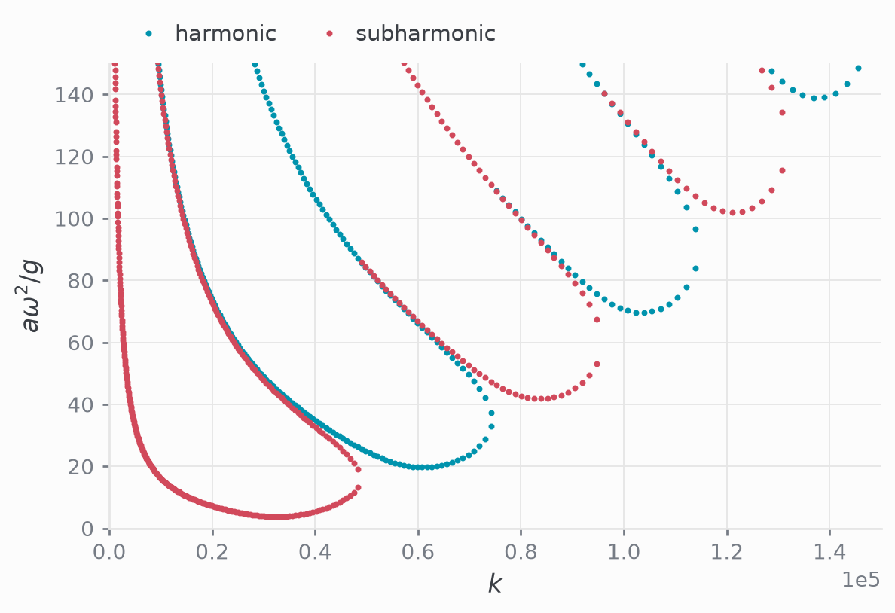
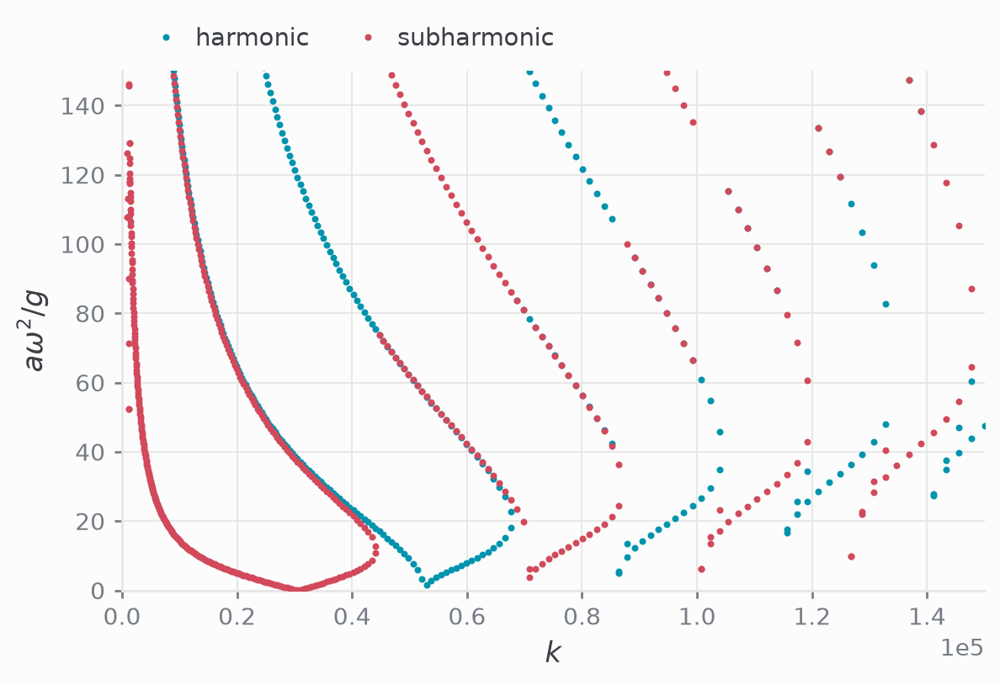

[Part 2](../2026-08-faraday-kt94-eigenvalue-problem/) solved the full
hydrodynamic system by hand: the bulk equation has constant coefficients, so
each layer admits four exponentials, and the eight constants are fixed by
matching. That is an elegant solution. However, if we change the base state, add
a mean flow, stratify a layer, and the closed form disappears along with the
method.

An alternative is to discretise the FHS as it stands and let a spectral solver
assemble the matrices. It may costs degrees of freedom but it's also more
flexible. This part sets the problem up in
[Dedalus](https://dedalus-project.org/), which takes equations entered as
strings and builds the sparse matrices itself.

## Primitive variables

[Part 1](../2026-08-faraday-linear-stability/) eliminated pressure and the
horizontal velocity to obtain one fourth-order equation in $w$. For this
approach, we keep $u_\beta$, $w_\beta$, $p_\beta$ in each layer plus the
interface elevation $\eta$, and work in two dimensions with a single horizontal
wavenumber $k$, so that $\partial_x \to i k$.

The Floquet structure is handled the same way. Writing the fast time $\tau
= \omega t$, periodic on $[0, 2\pi]$, the ansatz of part 1 becomes the
substitution

$$
\begin{aligned}
\frac{\partial}{\partial t} \to \lambda + i \hat{\alpha} + \frac{\partial}{\partial\tau},
\end{aligned}
$$

Marginal stability is $\lambda = 0$, and the two branches are $\hat\alpha = 0$
(harmonic) and $\hat\alpha = 1/2$ (subharmonic). The Fourier truncation in
$\tau$ *is* the truncation at $|n| \le N$ — it is just not written out by hand.

## Scales and control parameters

Take $[L] = k^{-1}$, $[T] = \omega^{-1}$, $[V] = \omega/k$, and $[P] = \rho_1
\omega^2 k^{-2}$, using the lower layer as the reference density. The
dimensionless system depends on a vibrational Reynolds, Froude and Weber numbers

$$
\begin{aligned}
\mathrm{Re}_\omega = \frac{\rho_1 \omega}{\mu_1 k^2}, \qquad
\mathrm{Fr}_\omega = \omega \sqrt{\frac{\rho_1}{(\rho_1 - \rho_2) g k}}, \qquad
\mathrm{We}_\omega = \frac{\rho_1 \omega^2}{\gamma k^3},
\end{aligned}
$$
in addition to the viscosity and density ratios, $\tilde{\rho}_2 = \rho_2/\rho_1$
and $\tilde{\mu}_2 = \mu_2/\mu_1$.

## Dimensionless equation system
### Bulk equations
In each layer, incompressibility and the two momentum components read

$$
\begin{aligned}
i u_1 + \partial_z w_1 &= 0, \\
\left[ (i\hat{\alpha} + \partial_\tau) - \frac{1}{\text{Re}_\omega} (\partial_{zz} - 1) \right] u_1 + i p_1 &= 0, \\
\left[ (i\hat{\alpha} + \partial_\tau) - \frac{1}{\text{Re}_\omega}  (\partial_{zz} - 1) \right] w_1 + \partial_z p_1 &= 0,
\end{aligned}
$$

and identically in layer 2 
$$
\begin{aligned}
i u_2 + \partial_z w_2 &= 0, \\
\left[ \tilde{\rho_2}(i\hat{\alpha} + \partial_\tau) - \frac{\tilde{\mu}_2}{\text{Re}_\omega} (\partial_{zz} - 1) \right] u_2 + i p_2 &= 0, \\
\left[ \tilde{\rho_2}(i\hat{\alpha} + \partial_\tau) - \frac{\tilde{\mu}_2}{\text{Re}_\omega}  (\partial_{zz} - 1) \right] w_2 + \partial_z p_2 &= 0,
\end{aligned}
$$

### Boundary conditions

At the walls $z = -d_1$ and $z = d_2$, with $d_\beta = k h_\beta$, both
components vanish,

$$
\begin{aligned}
u_\beta = 0, \qquad w_\beta = 0,
\end{aligned}
$$

which is equivalent to part 1's conditions on $w$ and $\partial_z w$, since
incompressibility ties $i u_\beta = -\partial_z w_\beta$. 

### Conditions at the interface

The five conditions at $z = 0$ are the kinematic condition, continuity of both
velocity components, and continuity of tangential and normal stress:

$$
\begin{aligned}
(i\hat{\alpha} + \partial_\tau) \eta - w_1 &= 0, 
\\
w_1 - w_2 &= 0, 
\\
u_1 - u_2 &= 0, 
\\
\left( \partial_z u_1 + i w_1 \right) - \tilde{\mu}_2 \left( \partial_z u_2 + i w_2 \right) &= 0, 
\\
\left[ -p_1 + \frac{2}{\text{Re}_\omega} \partial_z w_1 \right] - 
\left[ -p_2 + \frac{2\tilde{\mu}_2}{\text{Re}_\omega} \partial_z w_2 \right] 
+ \left( \frac{1}{\text{Fr}^2_\omega} (1 + \frac{a\omega^2}{g} \cos{(\tau)}) + \frac{1}{\text{We}_\omega} \right) \eta  &= 0.
\end{aligned}
$$

## Implementation in Dedalus
### Bases and fields

A Dedalus problem is written over *fields*, each expanded in a *basis* per
coordinate. The fast time is periodic, so it takes a Fourier basis, while $z$ is
bounded and non-periodic, so it takes Chebyshev (one per layer, since the two
subdomains are separate).

```python
import numpy as np
import dedalus.public as d3

coords = d3.CartesianCoordinates('tau', 'z')
dist = d3.Distributor(coords, dtype=np.complex128)
taucoord, zcoord = coords['tau'], coords['z']

basis_tau = d3.ComplexFourier(taucoord, size=Ntau, bounds=(0, 2 * np.pi))
basis_z1 = d3.ChebyshevT(zcoord, size=Nz, bounds=(-depth_factor, 0))
basis_z2 = d3.ChebyshevT(zcoord, size=Nz, bounds=(0, depth_factor))
```

Here, `Ntau` is the Floquet truncation and `Nz` the resolution in each layer. Fields
then span whichever bases they need: 
- the bulk unknowns span $(\tau, z)$,
- the elevation spans $\tau$ alone, 
- and the eigenvalue spans nothing.

```python
U1 = dist.Field(name='U1', bases=(basis_tau, basis_z1))
W1 = dist.Field(name='W1', bases=(basis_tau, basis_z1))
P1 = dist.Field(name='P1', bases=(basis_tau, basis_z1))
# ... U2, W2, P2 on basis_z2 ...
eta = dist.Field(name='eta', bases=basis_tau)
a = dist.Field(name='a')
```

We set $\cos(\tau)$ on the grid, and Dedalus computes its coefficients. 
```python
cos_tau = dist.Field(name='cos_tau', bases=basis_tau)
cos_tau['g'] = np.cos(dist.local_grid(basis_tau))
```

### Tau variables

This is the largest deviation from the classic approach. A Chebyshev expansion
of a field carries $N_z$ coefficients, and imposing the bulk equation on all
$N_z$ of them leaves no freedom for the boundary conditions. 

The tau method restores it by adding to each equation an unknown amplitude
multiplying one chosen basis element, so the equation holds in every mode but
that one, and the boundary conditions hold exactly. `Lift` places the unknown in
the last coefficient of the first-derivative basis. For instance, 

```python
tau_u1_1 = dist.Field(name='tau_u1_1', bases=basis_tau)

Dz = lambda A: d3.Differentiate(A, zcoord)
Dtau = lambda A: d3.Differentiate(A, taucoord)
lift1 = lambda A, n: d3.Lift(A, basis_z1.derivative_basis(1), n)

Uz1 = Dz(U1) + lift1(tau_u1_1, -1)            # first-order form
Wz1 = Dz(W1) + lift1(tau_w1_1, -1)
```

Written in first-order form, each of the four second-order momentum equations
needs two such unknowns, giving eight. Those eight plus $\eta$ are matched by
exactly nine conditions: four at the walls and five at the interface. 

### Writing the equation system

With that in place the equations transcribe almost literally, one
`add_equation` per line of the system above.

```python
vars_ = [U1, W1, P1, U2, W2, P2, eta,
        tau_u1_1, tau_u2_1, tau_w1_1, tau_w2_1,
        tau_u1_2, tau_u2_2, tau_w1_2, tau_w2_2]
problem = d3.EVP(vars_, eigenvalue=a, namespace=locals())

# Layer 1
problem.add_equation("ii*U1 + Wz1 = 0") 
problem.add_equation("ii*alpha_hat*U1 + Dtau(U1) - C1*(Dz(Uz1) - U1)"
                     " + ii*P1 + lift1(tau_u2_1,-1) = 0") 
problem.add_equation("ii*alpha_hat*W1 + Dtau(W1) - C1*(Dz(Wz1) - W1)" 
                     " + Dz(P1) + lift1(tau_w2_1,-1) = 0")

# Layer 2
problem.add_equation("ii*U2 + Wz2 = 0")
problem.add_equation("r2*(ii*alpha_hat*U2 + Dtau(U2)) - C2*(Dz(Uz2) - U2)" 
                     " + ii*P2 + lift2(tau_u2_2,-1) = 0")
problem.add_equation("r2*(ii*alpha_hat*W2 + Dtau(W2)) - C2*(Dz(Wz2) - W2)" 
                     " + Dz(P2) + lift2(tau_w2_2,-1) = 0")

# Boundary conditions
problem.add_equation("U1(z=-depth_factor) = 0")
problem.add_equation("W1(z=-depth_factor) = 0")
problem.add_equation("U2(z=depth_factor) = 0")
problem.add_equation("W2(z=depth_factor) = 0")

# Conditions at the interface
problem.add_equation("ii*alpha_hat*eta + Dtau(eta) - W1(z=0) = 0")
problem.add_equation("W1(z=0) - W2(z=0) = 0")
problem.add_equation("U1(z=0) - U2(z=0) = 0")
problem.add_equation("C1*(Uz1(z=0) + ii*W1(z=0)) - C2*(Uz2(z=0) + ii*W2(z=0)) = 0")
problem.add_equation("(-P1(z=0) + 2*C1*Wz1(z=0)) - (-P2(z=0) + 2*C2*Wz2(z=0))"
                     " + (G_g + G_gamma)*eta + G_g*a*cos_tau*eta = 0")
```

Here, `alpha_hat` is $0$ or $1/2$ and selects the branch, `ii` is $i$, and the
coefficients are the groups above gathered into single numbers,

$$
\begin{aligned}
\texttt{C1} = \frac{1}{\mathrm{Re}_\omega}, \qquad
\texttt{C2} = \frac{\tilde\mu_2}{\mathrm{Re}_\omega}, \qquad
\texttt{r2} = \tilde\rho_2, \qquad
\texttt{G\_g} = \frac{1}{\mathrm{Fr}^2_\omega}, \qquad
\texttt{G\_gamma} = \frac{1}{\mathrm{We}_\omega},
\end{aligned}
$$

so the eigenvalue `a` is the dimensionless amplitude $a\omega^2/g$.

### Solving

`build_solver()` assembles the generalised problem

$$
\begin{aligned}
\mathcal{A} \boldsymbol{x} = a \, \mathcal{B} \boldsymbol{x},
\end{aligned}
$$

with $\boldsymbol{x}$ the spectral coefficients of all $6 N_\tau N_z + 9 N_\tau$
unknowns, $\mathcal{A}$ collecting every amplitude-independent term and
$\mathcal{B}$ only the $\cos(\tau)$ one. 

A dense solve at this size is costly, so we use shift-and-invert Arnoldi:
iterating on $(\mathcal{A} - \sigma \mathcal{B})^{-1}\mathcal{B}$ returns the
few roots nearest a target $\sigma$ from one sparse factorisation. The method is
local, so it needs a seed — a reference value, or continuation from the
neighbouring $k$ — and since a physical amplitude is real and positive, the
spectrum is filtered afterwards.

```python
solver = problem.build_solver()
solver.solve_sparse(solver.subproblems[0], N=3, target=target)

evals = solver.eigenvalues
evals = evals[np.isfinite(evals)]
evals = evals[np.abs(evals.imag) < 1e-6 * (1.0 + np.abs(evals.real))]
evals = evals[(evals.real > 0) & (evals.real < real_cutoff)]
a_c = evals[np.argmin(np.abs(evals.real - target))].real
```

The surviving roots are the successive tongues $a_1 < a_2 < \dots$, the smallest
being onset. Repeating over $k$ and over $\hat\alpha \in \{0, 1/2\}$ traces the
neutral curves $a_c(k)$, and their minimum is the threshold.

## Does it agree?

Sweeping $k$ over both branches and both tongues reproduces the two panels of
Kumar & Tuckerman's figure 1. The viscous two-layer case converges at $N_z =
24$:



Each tongue descends to a tip, alternating subharmonic and harmonic, the lowest
tip fixing the onset amplitude and the wavelength selected there. 

The near-inviscid case is the same picture with far weaker damping — the tongues
grow narrow and nearly reach the axis, and resolving them needs $N_z = 200$:



It is worth being blunt about what this buys. Taken on its own, it is an
expensive way to compute a result we already knew: part 2 draws the same curves
from a $2N+1$ matrix, faster and without a single truncation in $z$. The return
comes later. Nothing in the formulation above relies on the bulk equation having
constant coefficients, or on the base state being quiescent — which is exactly
what the closed form needs. The same framework carries over to problems where no
closed form exists (or we're just being lazy), and that is where we are heading
next.

## References

T. B. Benjamin and F. Ursell, *The stability of the plane free surface of a
liquid in vertical periodic motion*, Proceedings of the Royal Society of London
A **225**, 505–515 (1954).
[doi:10.1098/rspa.1954.0218](https://doi.org/10.1098/rspa.1954.0218)

K. Kumar and L. S. Tuckerman, *Parametric instability of the interface between
two fluids*, Journal of Fluid Mechanics **279**, 49–68 (1994).
[doi:10.1017/S0022112094003812](https://doi.org/10.1017/S0022112094003812)

K. J. Burns, G. M. Vasil, J. S. Oishi, D. Lecoanet and B. P. Brown, *Dedalus: A
flexible framework for numerical simulations with spectral methods*, Physical
Review Research **2**, 023068 (2020).
[doi:10.1103/PhysRevResearch.2.023068](https://doi.org/10.1103/PhysRevResearch.2.023068)
