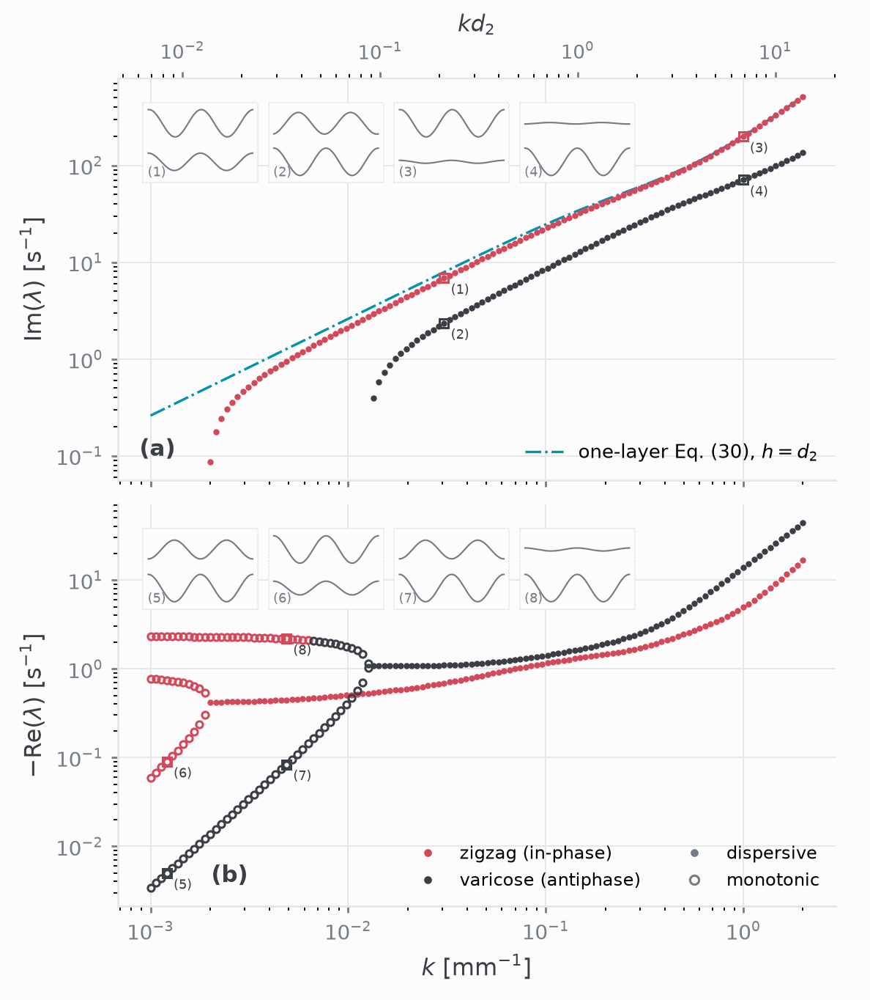
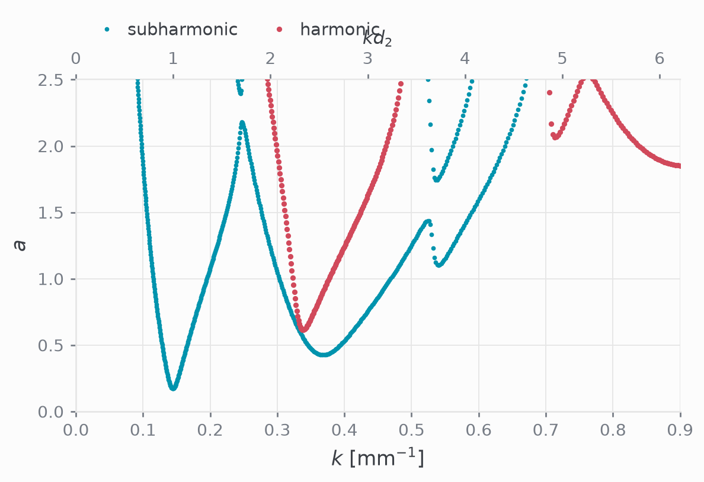
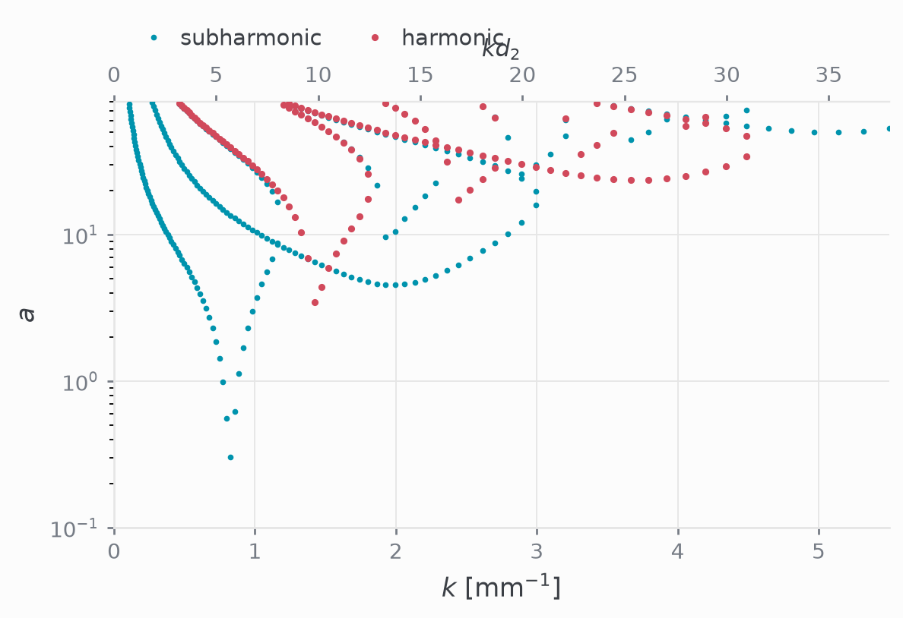

[Part 3](../2026-08-faraday-dedalus/) ended with a claim: the Dedalus
formulation was an expensive way to reproduce [Kumar & Tuckerman
(1994)](#references), but its real payoff is modularity.

To see this in practice, consider the two-layer liquid film with a deformable
upper free surface studied by [Pototsky & Bestehorn (2016)](#references). Fluid 1
occupies $z \in [0, d_1]$ above a rigid bottom plate, Fluid 2 occupies $z \in
[d_1, d_2]$, and the upper layer is an ambient gas of negligible density and
viscosity. The system now has two deformable interfaces: the liquid–liquid
boundary $\eta_1(\tau)$ at $z = d_1$, and the liquid–gas free surface
$\eta_2(\tau)$ at $z = d_2$.

## What stays the same

Because Dedalus treats differential operators and boundary conditions
modularly, the bulk and the unchanged boundaries require zero modifications:

- **Bulk equations:** Incompressibility and the two momentum equations in Layer 1
  and Layer 2 are identical.
- **Bottom plate ($z = 0$):** No-slip and no-penetration ($u_1 = 0$, $w_1 = 0$)
  remain unchanged.
- **Liquid–liquid interface ($z = d_1$):** The kinematic condition, continuity of
  normal and tangential velocity, continuity of tangential stress, and the normal
  stress jump remain identical.

## What changes: the upper boundary

In KT94, the upper boundary was a rigid wall:

$$
\begin{aligned}
u_2 = 0, \qquad w_2 = 0 \qquad (z = d_2).
\end{aligned}
$$

In PB16, the top boundary is a free surface governed by three conditions:

$$
\begin{aligned}
(i\hat{\alpha} + \partial_\tau) \eta_2 - w_2 &= 0, \\
\partial_z u_2 + i \hat{k} w_2 &= 0, \\
\left[-p_2 + \frac{2\tilde{\mu}_2}{\text{Re}_\omega} \partial_z w_2\right] + \left[ \frac{\tilde{\rho}_2}{\text{Fr}_{\omega, 2}^2} (1 + \frac{a\omega^2}{g}\cos{(\tau)}) + \frac{1}{\text{We}_{\omega, 2}} \right] \eta_2 &= 0.
\end{aligned}
$$

These represent, respectively:
1. **Kinematic condition** for the upper elevation $\eta_2$,
2. **Zero tangential shear stress** (free surface with negligible gas viscosity),
3. **Normal stress balance** accounting for fluid 2 pressure, viscous normal
   stress, interfacial tension $\gamma_2$, and the parametric acceleration.

## In Dedalus: a 5-line change

In the Dedalus script, this means defining one additional elevation field:

```python
eta2 = dist.Field(name='eta2', bases=basis_tau)
```

and swapping the two rigid-wall lines for the three free-surface conditions:

```python
# --- Old: KT94 rigid top wall (z = d2) ---
# problem.add_equation("U2(z=d2) = 0")
# problem.add_equation("W2(z=d2) = 0")

# --- New: PB16 deformable free surface (z = d2) ---
problem.add_equation(f"ii*alpha_hat*eta2 + Dtau(eta2) - W2(z={z_top}) = 0")
problem.add_equation(f"Uz2(z={z_top}) + ii*khat*W2(z={z_top}) = 0")
problem.add_equation(
    f"-P2(z={z_top}) + 2*C2*Wz2(z={z_top}) "
    f"+ (G_g2 + G_gamma2)*eta2 + G_g2*a*cos_tau*eta2 = 0"
)
```

Everything else—the Chebyshev and Fourier bases, tau lifting, and the
shift-and-invert Arnoldi solve—stays exactly as written.

## Validation: unforced dispersion relation

Before turning to the forced problem, the unforced base state ($a = 0$) serves
as an initial sanity check. With two deformable interfaces, the system admits
two coupled mode families: an in-phase (zigzag) branch and an out-of-phase
(varicose) branch. 

Sweeping $k$ reproduces the dispersion relation and damping rates of PB06's
figure 2, including monotonic damping modes and the single-layer asymptotic
comparison,



## Validation: Faraday instability tongues

With vertical vibration enabled ($a > 0$), sweeping $k$ and solving the
eigenvalue problem across both Floquet branches reproduces the marginal
stability tongues of figure 4. 

At low frequency ($f = 10\text{ Hz}$), the subharmonic branch dominates onset at
low wavenumbers before crossing over.



At higher frequency ($f = 50\text{ Hz}$), the tongues become denser and narrow,
shifting onset towards larger wavenumbers.



Because the formulation is modular, the same pattern carries forward. We could
take into account the effect of air by solving for the gas phase as well or
stack additional liquid layers by adding more subdomain bases and matching
conditions, without touching the underlying solver.

## References

K. Kumar and L. S. Tuckerman, *Parametric instability of the interface between
two fluids*, Journal of Fluid Mechanics **279**, 49–68 (1994).
[doi:10.1017/S0022112094003812](https://doi.org/10.1017/S0022112094003812)

A. Pototsky and M. Bestehorn, *Faraday instability of a two-layer liquid film with
a free upper surface*, Physical Review Fluids **1**, 023901 (2016).
[doi:10.1103/PhysRevFluids.1.023901](https://doi.org/10.1103/PhysRevFluids.1.023901)

K. J. Burns, G. M. Vasil, J. S. Oishi, D. Lecoanet and B. P. Brown, *Dedalus: A
flexible framework for numerical simulations with spectral methods*, Physical
Review Research **2**, 023068 (2020).
[doi:10.1103/PhysRevResearch.2.023068](https://doi.org/10.1103/PhysRevResearch.2.023068)
